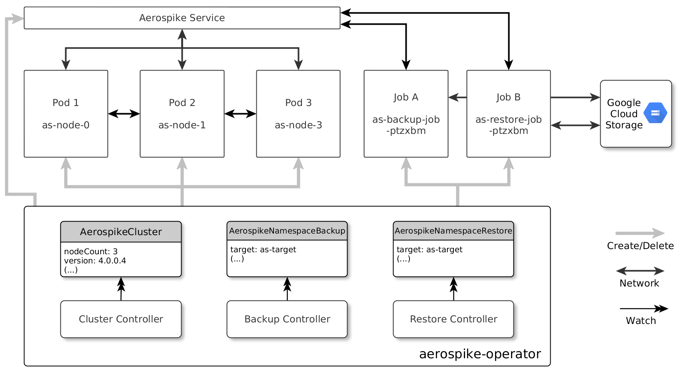
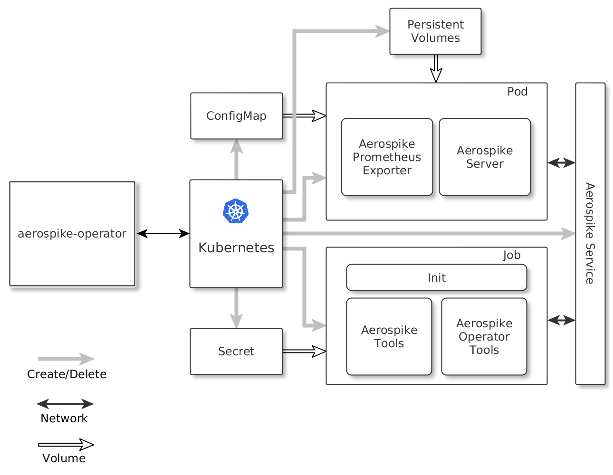
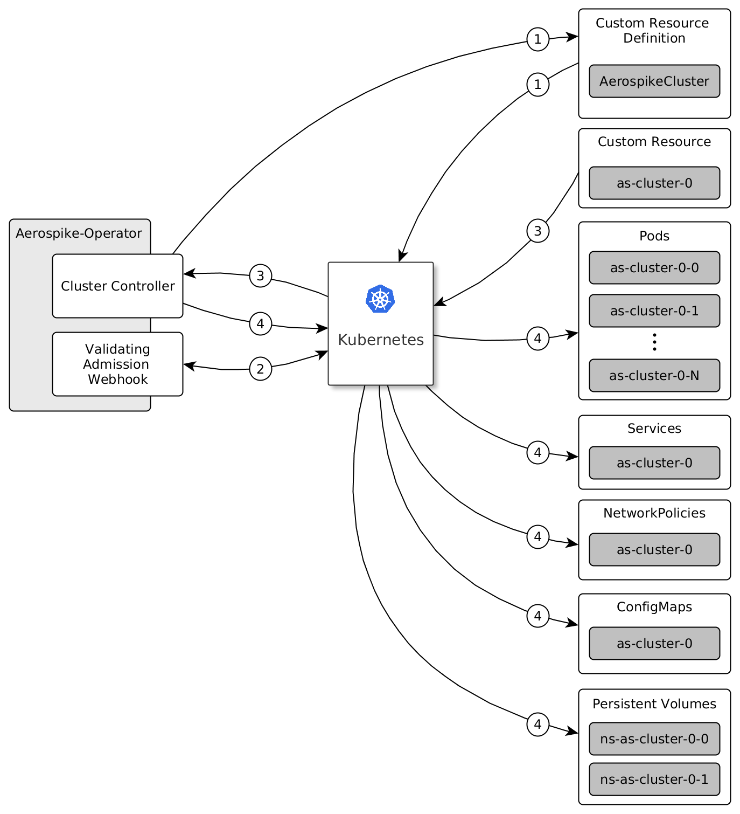
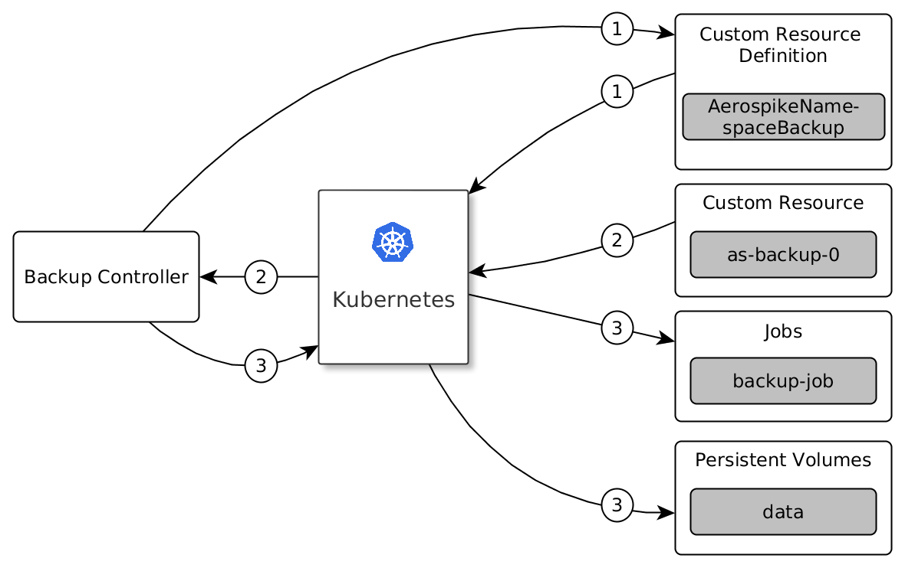
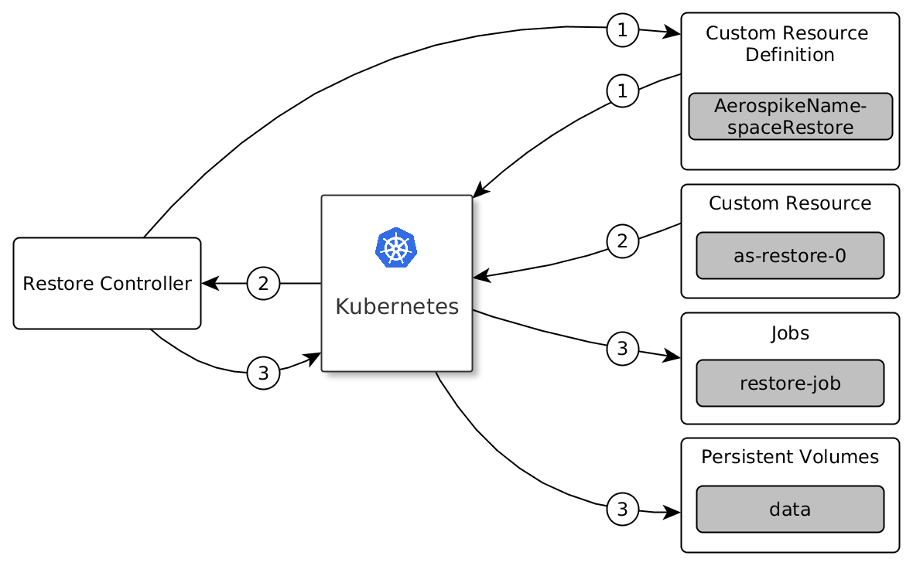

[[toc]]
= Design
This document describes the design of aerospike-operator and the interactions between the custom resource definitions it introduces, its internal components and Kubernetes.
:icons: font
:toc:

== Architecture

`aerospike-operator` runs within a Kubernetes cluster and actively monitors
changes to a number of
https://kubernetes.io/docs/concepts/api-extension/custom-resources/[custom resources]
it introduces:

[[custom-resource-definitions]]
* <<api-spec.adoc#aerospikecluster,`AerospikeCluster`>>: represents an Aerospike
cluster managed by `aerospike-operator`. It specifies the version of Aerospike
to be deployed, the number of nodes in the cluster and the list and properties
of the Aerospike namespaces in the cluster.
* <<api-spec.adoc#aerospikenamespacebackup,`AerospikeNamespaceBackup`>>:
represents a single backup operation targeting a given Aerospike namespace, as
well as how the backup data should be stored in a cloud storage provider.
* <<api-spec.adoc#aerospikenamespacerestore,`AerospikeNamespaceRestore`>>:
represents a single restore operation targeting a given Aerospike namespace, as
well as how the source backup data should be retrieved from a cloud storage
provider.

`aerospike-operator` watches for changes to the custom resources specified
above, as well as to Kubernetes resources it directly manages (pods, services,
config maps and persistent volumes). For every change it gets notified about,
`aerospike-operator` triggers a reconcilitation process and attempts to bring
the state of the managed resources in line with the desired state. Such
reconciliation processes live in components called _controllers_. There are
three main controllers in `aerospike-operator`:

[[controllers]]
* *Cluster Controller:* This controller is responsible for managing an Aerospike
  cluster based on the spec provided in an `AerospikeCluster` resource. It is
  also responsible for managing the Aerospike namespaces in the cluster.
* *Backup Controller:* This controller is responsible for creating backups of
  Aerospike namespaces based on the spec provided in an
  `AerospikeNamespaceBackup` resource.
* *Restore Controller:* This controller is responsible for restoring backups of
  Aerospike namespaces based on the spec provided in an
  `AerospikeNamespaceRestore` resource.

The following pictures provides a simplified overview of `aerospike-operator` 's
internal architecture and the interactions with some of the Kubernetes resources
used:

At a high level, `aerospike-operator` manages _pods_ and _jobs_. Every pod is a
member of a single Aerospike cluster. For every cluster `aerospike-operator`
creates a service that is used to facilitate clustering and client access.
Whenever a pod is created and the Aerospike process is ready to accept
connections, the service's endpoints are updated to include the IP of the new
pod. Similarly, when a pod is deleted the service's endpoints are updated in
order to remove the pod's IP.

Jobs are responsible for backing up and restoring data in a given Aerospike namespace,
and are created as necessary when a backup or restore is requested (i.e., when an
`AerospikeNamespaceBackup` or `AerospikeNamespaceRestore` resources are
created). These jobs are themselves clients of the Aerospike cluster, using the
abovementioned service to discover nodes and perform the backup and restore
process. These jobs also communicate with an external cloud storage provider
such as Google Cloud Storage in order to upload or download backup data as
necessary.

The following picture provides a more detailed overview of what Kubernetes
resources are managed and used in an Aerospike cluster, as well as of the
internal structure of pods and jobs:

Every pod in a given Aerospike cluster will run two containers, the main one
being Aerospike server. An exporter of Aerospike metrics in Prometheus format
will run in every pod as a sidecar container, allowing for scrapping metrics
from the node it is running on. Every pod will have a number of persistent
volumes attached (one per Aerospike namespace). Each of these volumes are
created and managed by `aerospike-operator` and will store the data for a single
Aerospike namespace. A config map containing the Aerospike configuration will
also be mounted at each pod.

Jobs launched by `aerospike-operator` will run a custom container that will be
responsible for interacting with `asbackup` or `asrestore` and with the cloud
storage provider. Since uploads/downloads are streamed to/from Google Cloud
Storage there is no need to provision these jobs with persistent volumes. This
allows for faster and cheaper backup/restore operations while ensuring the
consistency of the backup data. A _pre-existing_ secret containing credentials
to access the cloud storage provider will be mounted in each job. This secret is
_not_ managed by `aerospike-operator`, and must be created by the user according
to a pre-established structure described in
<<backup-and-restore.adoc#gcs-credentials,Google Cloud Storage Credentials>>.
Jobs discover pods in the Aerospike cluster using the Aerospike service, then
connect to these pods in order to backup and restore data for a given Aerospike
namespace.

The creation and management of the pods and jobs mentioned above is the
responsibility of the <<controllers,controllers>>. In the next section we
briefly describe the responsibilities of each of these controllers.

<<toc,Back>>

== Controllers

=== Cluster Controller

The _cluster controller_ is responsible for managing an Aerospike cluster based
on the spec provided in an `AerospikeCluster` resource, and for managing the
Aerospike namespaces that exist in this cluster and the means of storage for this
data. This includes creating or deleting pods, creating the service used for
clustering and discovery, creating and updating the underlying Aerospike
configuration and ensuring that operations such as scaling up or down happen
smoothly, taking into account any possible rebalancing operations that may be
happening at a given moment. A simplified overview of this controller's
mechanism of action can be seen in the picture below:

. When the controller starts, it registers the `AerospikeCluster` custom
resource definition within Kubernetes, and instructs Kubernetes to notify the
controller of any _create_ and _update_ and _delete_ operations performed in
`AerospikeCluster` resources.
. Whenever a given `AerospikeCluster` resource is created or updated, a
<<webhooks,validating admission webhook>> living within `aerospike-operator` is
called. The webhook analyses the object and decides if the operation should be
allowed or rejected. This allows for dynamic validation of a cluster's spec and
for providing immediate feedback about any validation errors.
. If the operation was allowed by the webhook, the controller gets notified
about the changes.
. The controller then analyzes and compares the current state of the resource
with the new desired state, taking the necessary actions in order to bring
current and desired states in sync. This means, for instance, creating pods
in a scale-up operation, deleting pods in a scale-down operation, creating the
necessary service and managing the persistent volumes where Aerospike namespace
data will be stored.

It should be noted that the cluster controller also watches pods belonging to a
given Aerospike cluster. Whenever one of the pods gets terminated (e.g., due to
an accidental delete or a node crash), `aerospike-operator` will create a new
pod to replace it. The same happens with services, config maps and persistent
volumes.

<<toc,Back>>

=== Backup Controller

The _backup controller_ is responsible for creating backups of a given Aerospike
namespace based on the spec provided in an `AerospikeNamespaceBackup` resource.
This includes creating a Kubernetes job for every backup operation and ensuring
this job completes successfully.

. When the controller starts, it registers the `AerospikeNamespaceBackup` custom
resource definition within Kubernetes, and instructs Kubernetes to notify the
controller of any _create_ operations performed in `AerospikeNamespaceBackup`
resources.
. Whenever a given `AerospikeNamespaceBackup` resource is created, the
controller gets notified of the change by Kubernetes.
. The controller then proceeds to launch a Kubernetes job that will be
responsible for backing-up data using `asbackup`. Backup data is streamed to
cloud storage as `asbackup` writes it.

NOTE: Backups are not deleted when the corresponding `AerospikeNamespaceBackup`
resource is deleted. This behaviour is intentional and helps preventing
accidental deletion of important backup data. For details on when backup data is
deleted please refer to
<<garbage-collection-backup-data,Garbage Collection>>.

<<toc,Back>>

=== Restore Controller

. When the controller starts, it registers the `AerospikeNamespaceRestore`
custom resource definition within Kubernetes, and instructs Kubernetes to notify
the controller of any _create_ operations performed in
`AerospikeNamespaceRestore` resources.
. Whenever a given `AerospikeNamespaceRestore` resource is created, the
controller gets notified of the change by Kubernetes.
. The controller then proceeds to launch a Kubernetes job that will be
responsible for streaming the backup data and restoring it using `asrestore`.

<<toc,Back>>

== Garbage Collection

The lifecycle of most objects managed by `aerospike-operator` will be tied to
the lifecycle of the originating
<<custom-resource-definitions,custom resource>>. This will be achieved using
Kubernetes
https://kubernetes.io/docs/concepts/workloads/controllers/garbage-collection/#owners-and-dependents[owner references]
and will allow for the Kubernetes
https://kubernetes.io/docs/concepts/workloads/controllers/garbage-collection/#controlling-how-the-garbage-collector-deletes-dependents[garbage collector]
to garbage-collect most leftover resources (e.g., leftover pods when their
originating `AerospikeCluster` is deleted).

However, some resources will need to be garbage-collected in a custom fashion.
For these resources, a custom garbage collector will be implemented. The
garbage collector will run periodically and cleanup any leftover resources. The
period between successive runs of the garbage collector may be configured. The
resources targeted by the garbage collector and its behaviour with respect to
these resources are identified in the next sections.

[[garbage-collection-backup-data]]
=== Backup data

The `AerospikeNamespaceBackup` custom resource features a `ttl` field which
represents the retention period for the backup data in the cloud storage
provider. Since in most cloud storage providers the lifecycle of individuals is
managed by a bucket-level policy, this TTL will be enforced for individual
backups by the garbage collector. Every time the garbage collection process runs
it looks for completed backup jobs whose TTL has expired, and deletes the
associated backup data from the cloud storage provider.

<<toc,Back>>

[[webhooks]]
== Webhooks

While the format of a custom resource's fields can be validated statically using
an
https://kubernetes.io/docs/tasks/access-kubernetes-api/extend-api-custom-resource-definitions/#validation[OpenAPI v3 schema],
some more involved, dynamic validations may be required for some types of custom
resources. For example, it is a good idea to enforce that the replication factor
for a given Aerospike namespace is not larger than size of the cluster it belongs
to. In order to achieve this, `aerospike-operator` makes use of
https://kubernetes.io/docs/admin/extensible-admission-controllers/#admission-webhooks[validating admission webhooks]: HTTP callbacks that are called when a given object is acted
upon (e.g., created or updated). These callbacks may be used to either accept or
reject the action in a _synchronous_ fashion, hence providing immediate feedback
and a better user experience.

Validating admission webhooks may live either inside or outside a Kubernetes
cluster, and they must be registered using the Kubernetes API in order to be
called. In the case of `aerospike-operator`, introduced webhooks are exposed via
the application itself, and are registered when the application starts (unless
admission is explicitly disabled when starting the application, in which case no
registration happens).

=== AerospikeCluster

The `aerospikeclusters.aerospike.travelaudience.com` webhook is called whenever
a given `AerospikeCluster` resource is created or updated, and enforces that:

* No Aerospike namespaces have been removed or changed.
* For every new Aerospike namespace, the replication factor is less than or equal to the
  size of the cluster.
