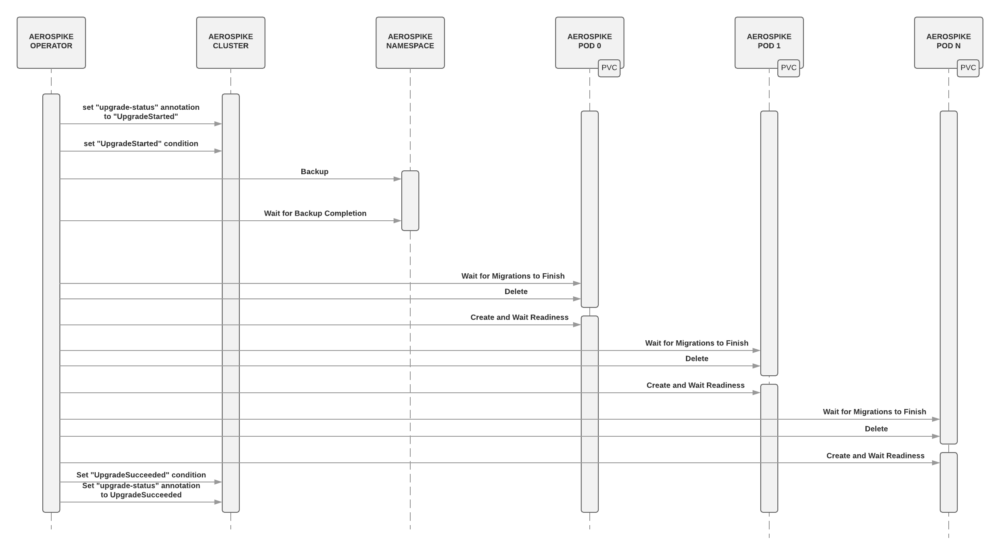

= Upgrades
This document describes how upgrade operations are performed by aerospike-operator.
:icons: font
:toc:

== Background

The versioning scheme used by Aerospike Server is
`<major>.<minor>.<patch>.<revision>`. Changes introduced in each version can be
categorized as follows:

* *Major* upgrades usually introduce major features.
* *Minor* upgrades usually introduce new features. Deprecated features may be
  removed, and upgrades to the storage or wire protocols may be introduced.
* *Patch* upgrades usually introduce improvements to existing features. They may
  also deprecate (but not remove) existing features and configuration
  properties.
* *Revision* upgrades usually introduce bug fixes only.

Aerospike Tools footnote:[https://www.aerospike.com/docs/tools] (which
`aerospike-operator` uses to implement the backup and restore functionality)
follows a similar versioning scheme.

Historically, directly upgrading between revision versions (e.g. `4.0.0.1` to
`4.0.0.4`) and patch versions (e.g. `3.15.0.2` to `3.15.1.3`) has been fully
supported, regardless of the source and target versions. This does not happen
with minor versions, however. For example, an upgrade from `3.12.1.3` to
`3.16.0.6` is required to "touch-base" at `3.13`, and further requires updating
the Aerospike configuration in order to upgrade the heartbeat and paxos
protocols
footnote:[https://www.aerospike.com/docs/operations/upgrade/cluster_to_3_13#2-upgrade-the-heartbeat-protocol-and-paxos-protocol-versions]
before proceeding further with the upgrade. Upgrading between major versions has
historically been a more involved procedure
footnote:[https://www.aerospike.com/docs/operations/upgrade/2_to_3], and usually
requires careful case-by-case analysis and planning.

[[recommended-flow]]
The recommended flow
footnoteref:[recommended-flow,https://www.aerospike.com/docs/operations/upgrade/aerospike/index.html]
for upgrading an Aerospike cluster involves upgrading one node at a time using
the following procedure:

. Wait until there are no migrations in progress on the target node.
. Stop the Aerospike server process.
. Upgrade the version of Aerospike server.
. Update the configuration (if necessary).
. Cold-start
  footnote:[https://www.aerospike.com/docs/operations/upgrade/aerospike/index.html#-important-points-to-review-when-planning-an-upgrade-]
  the Aerospike server process.

This procedure must then be repeated for the remaining nodes in the cluster. The
Aerospike documentation further mentions
footnote:[https://www.aerospike.com/docs/operations/upgrade/aerospike/index.html#-important-points-to-review-when-planning-an-upgrade-]
that when upgrading from a version greater than `3.13` it is not necessary to
wait for migrations to complete on a node before proceeding to upgrading the
next node (i.e. after Step 5), being enough to wait for the node to rejoin the
cluster. It should be noted, however, that cold-starting an Aerospike node
holding considerable amounts of data can take a long time
footnote:[Even though the documentation mentions "40+ minutes" (per-node) for a cold-start, such as in https://www.aerospike.com/docs/operations/manage/aerospike/fast_start, our tests show that it can take considerably more depending on the amount of data stored in each node.],
and that the node only rejoins the cluster after the initial data loading
process is complete.

== Goals

* Provide support for upgrading an existing Aerospike cluster
  to a more recent minor, patch or release version.
* Provide adequate validation of the upgrade path before actually starting the
  upgrade process.
* Perform the upgrade while causing no cluster downtime
  footnote:[As exception must be made here for single-node clusters. In this scenario it is not possible to perform the upgrade procedure without cluster downtime.].
* Ensure that no permanent data loss occurs as a result of an upgrade operation. 

== Non-Goals

* Provide support for downgrading an existing Aerospike cluster.
* Provide support for upgrading an existing Aerospike cluster to a different
  major version.
* Implement automatic rollback or restore after a failed upgrade.

[[design-overview]]
== Design Overview

A version upgrade on a given Aerospike cluster is triggered by a change to
`.spec.version` field of the associated `AerospikeCluster` resource. The upgrade
procedure performed by `aerospike-operator` on the target Aerospike cluster 
is the procedure recommended footnoteref:[recommended-flow] in the Aerospike
documentation and described <<recommended-flow,above>>. For every pod in the
cluster, `aerospike-operator` will:

. Wait until there are no migrations in progress.
. Delete the pod.
. Create a new pod running the target version of Aerospike.

NOTE: Existing persistent volumes holding Aerospike namespace data will be
reused when creating the new pod.

By following the recommended procedure, `aerospike-operator` ensures maximum
service and data availability during cluster maintenance in almost all scenarios
footnote:[For clusters using a replication factor of 1, full data availability _during_ the upgrade procedure cannot be ensured.].
Furthermore, and in order to ensure the safety of the data managed by the
cluster, `aerospike-operator` will create a backup of each namespace
footnoteref:[single-namespace,The number of Aerospike namespaces per Aerospike cluster is currently limited to a single one]
in the target cluster to cloud storage before actually starting the upgrade
process. These backups can later be manually restored to a new Aerospike cluster
shall the upgrade process fail. An overview of the whole procedure is provided
below:

As mentioned above, `aerospike-operator` does its best to validate the
transition between the source and target versions before actually starting the
upgrade process. As such, every version of `aerospike-operator` will feature a
whitelist of supported Aerospike versions, as well as of the transitions between
them. New releases of Aerospike will be tracked and whitelisted by updated
versions of `aerospike-operator`. These updates to `aerospike-operator` will
also, whenever necessary, introduce custom code for handling a particular
upgrade path (such as the "manual" upgrade steps required by Aerospike 3.13
footnote:[https://www.aerospike.com/docs/operations/upgrade/cluster_to_3_13]
or 4.2 footnote:[https://www.aerospike.com/docs/operations/upgrade/storage_to_4_2]).

== Alternatives Considered

An alternative upgrade procedure was initially considered to replace the one
proposed in <<design-overview>>. This alternative approach would involve the
creation of a "surge pod" running the target Aerospike version before deleting a
pod running the source Aerospike version. This would help ensuring maximum
service and data availability during the upgrade process. However, and because
in this scenario the existing persistent volumes would not be reused, this
method would cause data loss in clusters containing namespace with a replication
factor of 1. Hence, a different method would have to be considered for this
scenario. As it is not practical to have different upgrade processes based on
the replication factor of a namespace, this approach has been abandoned.

An alternative approach for automatic pre-upgrade backups was also considered.
This alternative approach would involve backing-up namespaces to persistent
volumes rather than to cloud storage. Then, in case of a failed upgrade, the
affected namespaces could be manually restored from the abovementioned
persistent volume. However, using this approach would mean that a different,
separate method for backup and restore would need to be supported and maintained
(something that would likely cause confusion). Hence, this approach has also
been discarded.
